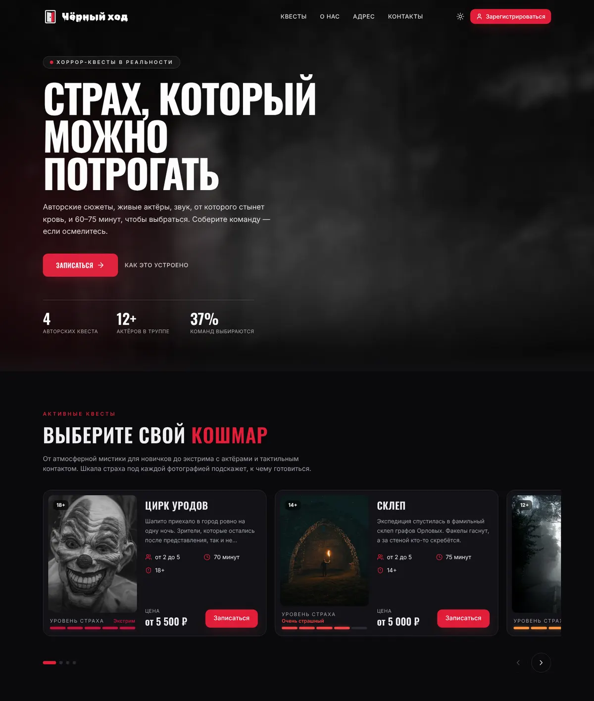
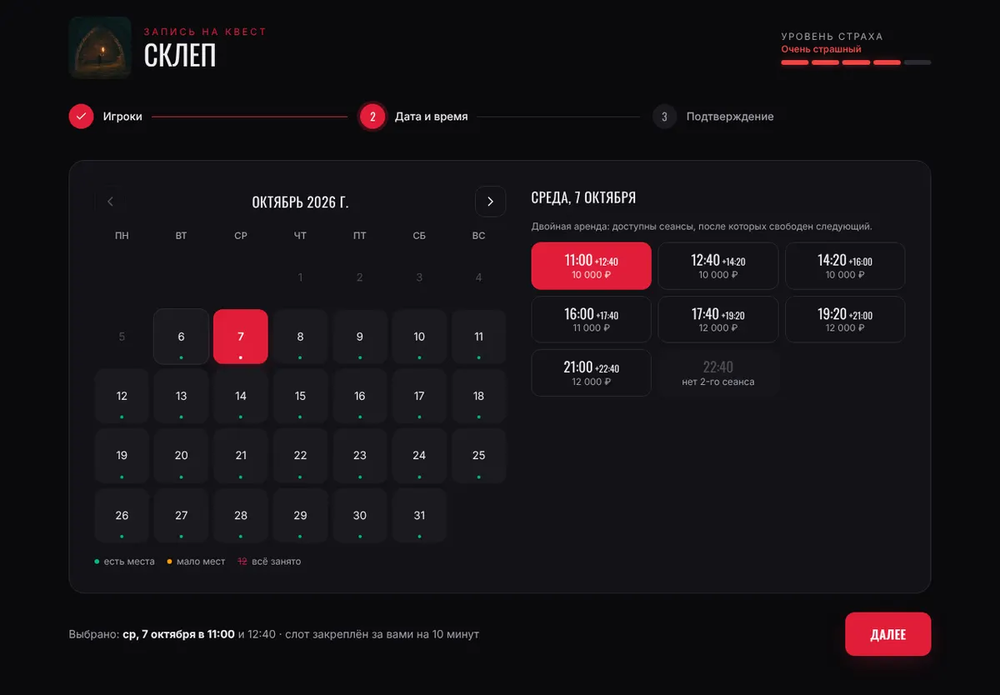
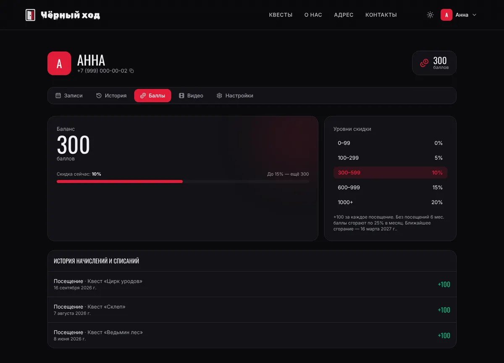
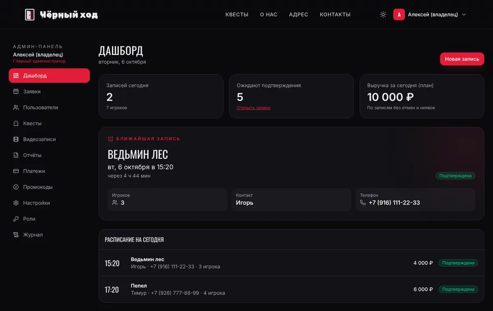
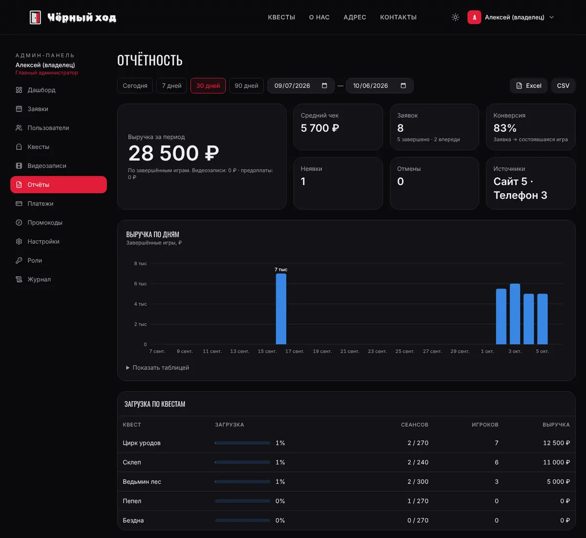

# «Чёрный ход» — сайт сети хоррор-квестов

Полноценный сайт для сети квест-комнат: онлайн-запись с календарём сеансов, регистрация по номеру телефона с подтверждением через Telegram / ВКонтакте / MAX, личный кабинет с программой лояльности, покупка видеозаписей прохождения, онлайн-трансляция с камер и админ-панель с разграничением прав.

Исходное ТЗ — [`docs/SPEC.md`](docs/SPEC.md).



| Запись на квест | Баллы в личном кабинете |
|---|---|
|  |  |
| **Дашборд администратора** | **Отчётность** |
|  |  |

## Стек

| Часть | Технологии |
|---|---|
| Фронтенд | React 19 + TypeScript, Vite, Tailwind CSS 4, framer-motion, TanStack Query, React Router, lucide-react, hls.js |
| Бэкенд | Node.js 22 + Express + TypeScript, REST API, валидация zod, JWT (access) + ротируемый refresh-токен в HttpOnly cookie |
| База данных | PostgreSQL 16 + Prisma ORM (миграции и сид) |
| Хранилище видео | локальный диск или S3-совместимое (MinIO, Yandex Object Storage), приватный бакет + подписанные временные ссылки |
| Видео с камер | MediaMTX: RTSP от IP-камер → HLS для трансляции, запись сеансов и автозагрузка в API |
| Оплата | ЮKassa (или тестовый провайдер `mock` для разработки) |

## Структура

```
.
├── server/                  # API
│   ├── prisma/              # schema.prisma, миграции, seed.ts (5 демо-квестов)
│   ├── scripts/             # регистрация webhook Telegram-бота
│   └── src/
│       ├── routes/          # auth, quests/content, bookings, profile, recordings, payments, streams, telegram
│       │   └── admin/       # заявки, пользователи и роли, квесты и настройки, видео, отчёты
│       ├── services/        # запись и цены, уведомления, оплата, хранилище, фоновые задачи
│       ├── lib/             # слоты расписания, лояльность, права, JWT, подписи
│       └── middleware/      # авторизация, проверка прав, журнал действий админов
├── web/                     # фронтенд
│   ├── public/              # изображения (WebP), robots.txt, favicon
│   ├── scripts/prerender.mjs
│   └── src/
│       ├── components/      # шапка, подвал, карусель квестов, календарь, выбор слота, UI-кит
│       ├── pages/           # главная, квест, вход, запись, кабинет, трансляция, документы
│       │   └── admin/       # админ-панель
│       └── lib/             # API-клиент, авторизация, тема, форматирование
├── deploy/                  # nginx, MediaMTX
└── docker-compose.yml       # PostgreSQL, MinIO, MediaMTX
```

## Быстрый старт

Нужны Node.js 22+ и PostgreSQL 16 (или Docker).

```bash
# 1. Инфраструктура: PostgreSQL (+ MinIO и MediaMTX, если нужны)
docker compose up -d db

# 2. Переменные окружения
cp server/.env.example server/.env
cp web/.env.example web/.env

# 3. Зависимости (корень ставит server/ и web/)
npm install

# 4. Схема БД и демо-данные
npm run db:deploy
npm run db:seed

# 5. API (http://localhost:4000) и сайт (http://localhost:5173)
npm run dev
```

В режиме разработки коды подтверждения не уходят в мессенджеры: они показываются прямо в форме входа и пишутся в лог API. Оплата идёт через тестовую страницу (`PAYMENT_PROVIDER=mock`).

### Демо-доступы (после `db:seed`)

| Роль | Телефон | Пароль |
|---|---|---|
| Главный администратор | +7 (999) 000-00-01 | `admin12345` |
| Заместитель | +7 (999) 000-00-11 | `deputy12345` |
| Бухгалтер | +7 (999) 000-00-12 | `account12345` |
| Оператор зала | +7 (999) 000-00-13 | `operator12345` |
| Клиент с историей, баллами и видео | +7 (999) 000-00-02 | `demo12345` |

Вход по паролю — ссылка «Войти по паролю» на странице входа. Промокод `STRAH10` даёт −10%, сертификат `GIFT-DEMO` — −3 000 ₽.

## Что реализовано

### Главная
- Липкая шапка: логотип слева, навигация по центру со смещением вправо (бургер на мобильных), справа — «Зарегистрироваться» или меню профиля (Профиль, Мои записи, Админ-панель для сотрудников, Выход).
- Hero на 88–100vh: фото `фон` с размытием 8px и тёмным оверлеем, заголовок, текст и CTA «Записаться». Тексты редактируются в админке.
- «Активные квесты»: 3+ квеста — карусель со стрелками, свайпом и точками; 2 — карточки по центру; 1 — увеличенная карточка. В карточке фото, шкала страха из 5 делений с цветом, описание, игроки, длительность, возраст, цена «от» и «Записаться».
- Блок «Информация»: что входит в квест, доп. опции (фотосессия, актёр, поздравление, сертификаты, видео, трансляция), правила посещения, FAQ-аккордеон.
- Адрес: карта Яндекса, клик по карте или адресу открывает построение маршрута; телефон, часы, соцсети.
- Подвал: навигация, контакты, политика конфиденциальности, согласие на обработку ПДн.

### Регистрация и вход
- Нажатие «Записаться» без входа ведёт на регистрацию, а после неё — обратно к выбранному квесту.
- Телефон с маской `+7 (___) ___-__-__`, выбор канала для кода (Telegram / ВКонтакте / MAX), обязательное согласие по 152-ФЗ.
- Код из 6 цифр, таймер 60 секунд, «Отправить повторно», не более 5 попыток ввода.
- Не больше 3 кодов за 10 минут на номер (проверка на сервере), невидимая Яндекс SmartCaptcha и honeypot-поле против ботов.
- Затем профиль: имя, дата рождения и e-mail (последние два необязательны). Повторный вход — по коду или по паролю, если он задан.

### Запись на квест
1. Количество и возраст игроков (каждого или диапазоном) с проверкой по ограничениям квеста. Если игроков больше максимума, предлагается **аренда двух сеансов подряд**: бронируются два соседних слота, цена пересчитывается.
2. Календарь с отметками «есть места / мало мест / всё занято» и свободные сеансы дня. Сетка сеансов = длительность квеста + технический перерыв из расписания. Выбранный слот **блокируется на 10 минут**.
3. Подтверждение: сводка, базовая цена, скидка по баллам, промокод или сертификат, итог и комментарий.

После записи уходит уведомление в мессенджер, напоминания приходят за 24 и за 2 часа. Статусы: новая → подтверждена → завершена / отменена / неявка. Время сеансов всегда показывается по часовому поясу площадки (`TZ` на сервере, `VITE_TZ` на фронте), а не по поясу браузера.

### Личный кабинет
- **Записи**: будущие игры со статусом и итоговой ценой. Отмена и перенос доступны не позднее чем за N часов до начала (настраивается).
- **История**: прошедшие квесты с результатом — выбрались ли и за сколько минут.
- **Баллы**: баланс, текущая скидка, прогресс до следующего уровня, история начислений и списаний, предупреждение и дата ближайшего сгорания.
- **Видео**: покупка записи с камер, скачивание по временной ссылке (срок задаётся в админке, по умолчанию 30 дней), размер и длительность файла.
- **Трансляция**: «Смотреть онлайн», пока идёт сеанс, и временная ссылка для друзей. Поток закрывается автоматически по окончании сеанса.
- **Настройки**: имя, дата рождения, e-mail, смена телефона с подтверждением кодом, привязка Telegram (через бота), ID ВКонтакте и MAX, уведомления, пароль.

### Программа лояльности
За посещение начисляется 100 баллов. Уровни скидки: 0–99 → 0%, 100–299 → 5%, 300–599 → 10%, 600–999 → 15%, 1000+ → 20%. Если клиент не приходит 6 месяцев, баллы сгорают по 25% в месяц; за 7 дней до этого приходит предупреждение. Все параметры меняются в админке.

### Админ-панель (`/admin`)
- **Роли**: главный администратор, заместитель, бухгалтер, оператор. Роли и пометки о них видит **только главный администратор**, остальным отображаются только имена. Права проверяются на сервере для каждого роута; набор прав каждой роли (кроме главного) можно менять.
- **Дашборд**: виджет «Ближайшая запись» (квест, время, игроки, контакт), расписание на сегодня, кто сейчас в комнате.
- **Заявки**: таблица с фильтрами по статусу, квесту, датам, имени и телефону; календарь загрузки по дням и часам; редактирование любых полей записи с проверкой пересечений; ручное создание записи; отметки «завершено» (с результатом), «неявка», «отменено».
- **Пользователи**: поиск, ручная регистрация, ручное подтверждение номера, корректировка баллов, блокировка (с подсветкой систематических неявок).
- **Квесты**: создание, изменение и скрытие — фото (с загрузкой), уровень страха, игроки, длительность, возраст, цены, номер комнаты, расписание по дням недели и перерывы.
- **Видеозаписи**: автозагрузка с камер с привязкой к заявке по комнате и времени, ручная привязка, загрузка, скачивание, удаление, срок хранения с автоудалением.
- **Отчёты**: выручка, средний чек, конверсия, неявки, отмены, источники заявок, выручка по дням, загрузка по квестам; экспорт в Excel и CSV.
- **Платежи**, **промокоды и сертификаты**, **настройки и тексты** (главная, контакты, режим оплаты, лояльность, видео), **журнал действий** администраторов.

### Безопасность и качество
- Валидация всех входящих данных на сервере (zod), rate limiting, helmet, CORS.
- Refresh-токен — в HttpOnly cookie с ротацией; access-токен живёт 15 минут и хранится только в памяти.
- Видео — в приватном хранилище, скачивание только по подписанным временным ссылкам. Трансляции — по HMAC-токену, который действует до конца сеанса.
- Журнал действий администраторов: кто, что и когда изменил.
- В продакшене API не запустится с секретами-заглушками из `.env.example`.
- Тёмная тема по умолчанию и светлая по переключателю, навигация с клавиатуры, фокус-стили, `prefers-reduced-motion`, контраст текста на фото.
- Скелетоны загрузки, пустые состояния, подтверждение всех действий, меняющих данные.
- SEO: мета-теги, Open Graph, микроразметка `LocalBusiness` и `Event` (JSON-LD), динамический `sitemap.xml`, `robots.txt`, пререндер главной.
- Изображения в WebP с lazy-loading. Админка, кабинет и hls.js грузятся отдельными чанками.

## Переменные окружения

### `server/.env`

| Переменная | Назначение |
|---|---|
| `DATABASE_URL` | строка подключения PostgreSQL |
| `TZ` | часовой пояс площадки (по нему строятся сеансы), по умолчанию `Europe/Moscow` |
| `APP_URL`, `API_URL` | публичные адреса сайта и API (CORS, ссылки в уведомлениях и на скачивание) |
| `JWT_ACCESS_SECRET`, `SIGNING_SECRET` | секреты токенов и подписанных ссылок — **обязательно смените** |
| `TELEGRAM_GATEWAY_TOKEN` | [Telegram Gateway API](https://core.telegram.org/gateway): коды подтверждения по номеру телефона |
| `TELEGRAM_BOT_TOKEN`, `TELEGRAM_BOT_USERNAME` | бот для уведомлений и привязки аккаунта; webhook — `npm --prefix server run telegram:webhook` |
| `ADMIN_TELEGRAM_CHAT_ID` | чат сотрудников для уведомлений о новых заявках |
| `VK_GROUP_TOKEN` | токен сообщества ВКонтакте (сообщения от сообщества) |
| `MAX_BOT_TOKEN` | токен бота в MAX |
| `SMARTCAPTCHA_SERVER_KEY` | серверный ключ Яндекс SmartCaptcha |
| `PAYMENT_PROVIDER` | `mock` или `yookassa`; для ЮKassa — `YOOKASSA_SHOP_ID`, `YOOKASSA_SECRET_KEY`; webhook: `{API_URL}/api/payments/webhook/yookassa` |
| `STORAGE_DRIVER` | `local` (папка `STORAGE_LOCAL_DIR`) или `s3` (`S3_ENDPOINT`, `S3_BUCKET`, `S3_ACCESS_KEY`, `S3_SECRET_KEY`) |
| `MEDIA_HLS_URL` | адрес HLS-сервера MediaMTX (поток комнаты N — `/roomN/index.m3u8`) |
| `MEDIA_API_URL` | Control API MediaMTX (`http://localhost:9997`) — включение записи на время сеанса |
| `INGEST_SECRET` | секрет камер и медиасервера: публикация потоков и загрузка записей |
| `WEB_DIST` | папка собранного фронтенда: если указана (или есть `./public`), API сам отдаёт сайт |
| `AUTH_SHOW_CODES` | `1` — показывать код подтверждения в форме входа (только для теста, пока не подключены мессенджеры) |
| `SEED_DEMO` | `0` — `npm run db:seed` создаёт только роли, квесты и владельца, без демо-данных |

### `web/.env`

| Переменная | Назначение |
|---|---|
| `VITE_API_URL` | адрес API, если он на другом домене (по умолчанию тот же домен, `/api`) |
| `VITE_SMARTCAPTCHA_KEY` | клиентский ключ SmartCaptcha |
| `VITE_TZ` | часовой пояс площадки для отображения времени (по умолчанию `Europe/Moscow`) |

## Камеры, запись и трансляции

1. `docker compose up -d mediamtx` поднимает MediaMTX с конфигом [`deploy/mediamtx.yml`](deploy/mediamtx.yml).
2. Камера комнаты N публикует поток на `rtsp://camera:<INGEST_SECRET>@<сервер>:8554/roomN`. Номер комнаты задаётся в карточке квеста.
3. API раз в 30 секунд включает запись комнаты на время сеанса и выключает после (`MEDIA_API_URL`). Закрытый файл MediaMTX сам отправляет в `POST /api/recordings/ingest`, а API привязывает его к заявке по комнате и времени. Если привязка не сработала, запись видна в админке как «не привязана».
4. Зрители получают HLS-поток только с токеном активного сеанса: MediaMTX проверяет каждый запрос через `POST /api/streams/mediamtx-auth`.

Камеры можно подключить и без MediaMTX: любой процесс может отправлять готовые файлы в `/api/recordings/ingest` (multipart: `file`, `room`, `recordedAt`, `durationSec`, заголовок `x-ingest-secret`).

## Демо-версия без сервера

```bash
npm --prefix web run build:demo   # → web/dist-demo/chernyhod.html (один файл ≈1,4 МБ)
```

Это тот же фронтенд, только API эмулируется прямо в браузере (`web/src/demo/server.ts`). Логика повторяет сервер: сетка сеансов, блокировки, двойная аренда, скидки, лояльность, роли и отчёты. Данные хранятся в localStorage посетителя, роутинг — в памяти, картинки встроены как data URI, внешних запросов нет. Вверху страницы — полоса быстрого входа (клиент, главный админ, оператор) и сброс данных. Трансляция показывается имитацией камеры; скачивание видео и отчётов в демо заменено подсказкой.

## Продакшен

```bash
npm run build                      # API → server/dist, сайт → web/dist
npm --prefix web run prerender     # пререндер главной (нужен запущенный API и playwright)
npm --prefix server run db:deploy  # миграции
NODE_ENV=production npm --prefix server start
```

- Хостинг с Node.js-сайтами (ispmanager, reg.ru): `node deploy/build-bundle.mjs` собирает архив, где один процесс отдаёт API и сайт. При старте `dist/start.js` сам применяет миграции и создаёт начальные данные. Пошагово — в [`deploy/ispmanager/README.md`](deploy/ispmanager/README.md).
- [`deploy/nginx.conf`](deploy/nginx.conf) — пример: статика, прокси `/api`, HTTPS, SPA-фолбэк, HLS.
- [`server/Dockerfile`](server/Dockerfile) — образ API: при старте применяет миграции.
- Фоновые задачи (напоминания, сгорание баллов, автоудаление видео, очистка блокировок, управление записью) запускаются в процессе API. При нескольких инстансах их стоит вынести в отдельный воркер.

## Что донастроить перед запуском

- **Фотографии.** Сейчас в `web/public/images` атмосферные заглушки с [Unsplash](https://unsplash.com/license): `fon.webp` для hero и фото квестов. Замените их снимками своих комнат: файлом или загрузкой в карточке квеста в админке.
- **Домен.** В `web/index.html` (canonical, Open Graph) и `web/public/robots.txt` указан `chernyhod.ru` — поставьте свой.
- **Тексты, адрес, координаты карты, соцсети** — в админке: «Настройки и тексты».
- **Ключи интеграций**: Telegram Gateway и бот, сообщество ВКонтакте, бот MAX, SmartCaptcha, ЮKassa, S3 (см. таблицу выше).
- **Юридические тексты** (`/privacy`, `/personal-data`) — шаблоны, их нужно сверить с юристом и вписать реквизиты оператора ПДн.

## Проверки

```bash
npm run typecheck   # TypeScript: server + web
npm run lint        # oxlint для фронтенда
npm run build
```

## Что можно развить дальше
- Полноценный SSR (например, перенос фронтенда на Next.js или vite-ssr) вместо пререндера одной страницы.
- Очередь задач (BullMQ + Redis) для уведомлений и фоновых операций при масштабировании.
- Онлайн-продажа подарочных сертификатов с красивым PDF и отправкой на почту.
- Таблица рекордов прохождения по каждому квесту и бейджи для постоянных игроков.
- Автотесты: e2e-сценарии записи на Playwright и юнит-тесты сетки слотов и расчёта скидок.
